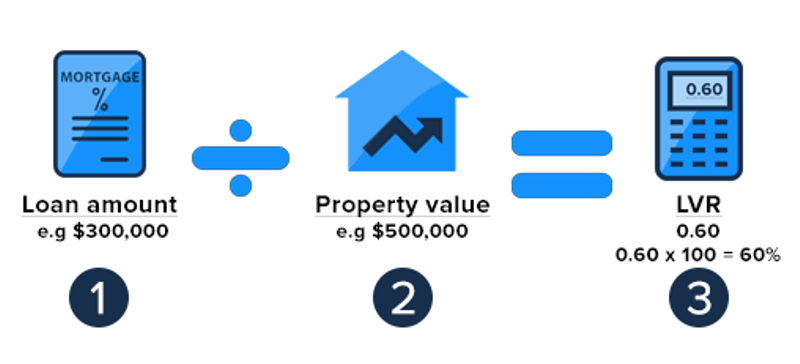
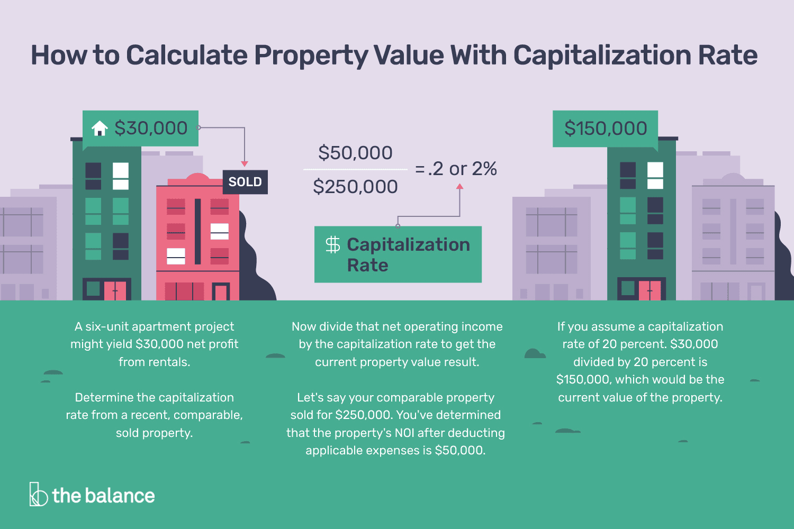
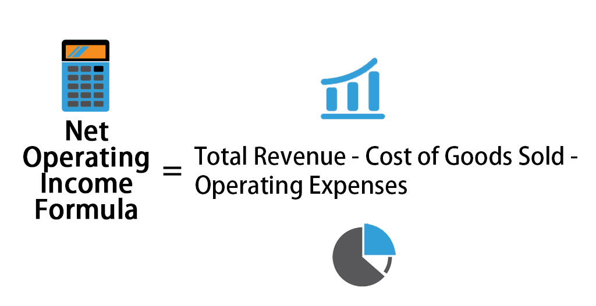
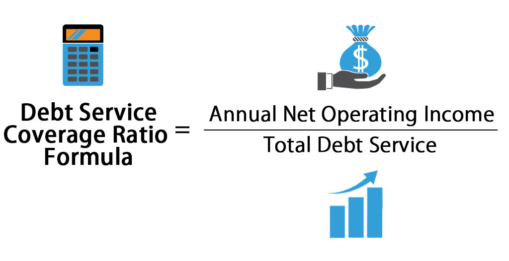

# Commercial Property Financing Application Screening Tool

This is a commercial property financing screening application for use by banks/lenders to evaluate the 
risks involved with a loan and calculate the interest rate on loans. This tool will extracts public data such as 
US Treasury Bond yield, US population by city/town and capitalization rate by property type. These data will then
be combined with loan specific information such as loan amount, location and Debt Service Coverage ratio (DSCR) 
to conduct a feasibility assessment on the loan application. 

## Key Finance Metrics Explained:
### Load-To-Value (LTV)
In simple terms, this is the loan amount divided by theoverall property value. The property value is typically evaluated by a certified appraiser who has extensive knowledge of the local market. Most banks/lenders have a maximum ratio for LTV for different property types

In this application, we utilize existing property data to create a regression model for property value estimation. As a rule of thumb: the higher the LTV, the riskier the loan is for the lender.

  

### Capitalization Rate (Cap Rate)
This is the rate that lenders use to calculate the property value. This is usually regarded as the rate of return on an annual basis from the investment property.

CBRE publishes the cap rates for major markets bi-annually. Here is an example of the 2019 report: https://www.cbre.us/research-and-reports/North-America-Cap-Rate-Survey-H1-2019

  

### Net Operating Income (NOI)
This is the net income generated by a property after deducting operating expenses. The NOI measures the ability of a property to generate income from operations. The value of the subject property equals the NOI divided by the Cap Rate.

  

### Debt-Service Coverage Ratio (DSCR)
This ratio is used to determine the borrower's ability to make debt service payments. It is defined as the NOI divided by the Annual Debt Service on the proposed loan. The debt service is the total principal and interest payment of the loan on an annual basis, A general rule of thumb: the greater the DSCR, the more flexibility the property provides (more income than expenses)

  

## Prerequisites

Users need to install several Java apis plug-ins within Eclipse. Please see below for installation instructions.

## How to run the program

Open "GUI.java" file where the main method resides -> Run

## Installation

#### Adding plug-ins and apis:
    1. Please follow instructions in this video: https://www.youtube.com/watch?v=OHbSx2iVujE or follow the steps below.
    2. In Eclipse, click "Help" -> "Install New Software"
    3. In "Work with" box, type your eclipse version (ie. Juno http://download-eclipse.org/releases/Juno) 
    4. Click on "General Purpose Tools" triangle, select "Swing Designer", "SWT Designer, "SWT Designer Core","SWT Designer SWT_AWT Support" 
    5. Also select "WindowBuider Core", "WindowBuilder Core Documentation", "WindowBuilder Core UI" and "WindowBuilder GroupLayout Support"
    5. Click "Next" -> "Next" -> accept the user agreement -> click "Finish"
    7. Click "Yes" to restart eclipse to complete the installation

### NOTE: In case Eclipse can not find libraries on its own, please remove all referenced libraries eclipse references and add the following referenced libraries and external jar files in the folder: 

#### Adding referenced libraries:

    1. Right click on the project in eclipse. Click on Properties.
    2. Click on Java Build Path on the left side menu
    3. Click on Libraries
    4. Click on Add External JARs
    5. For Windows, navigate to the lib folder in this project and add all JAR files in the folder to the project
    6. For Mac, navigate to the lib_mac folder in this project and add all JAR files in the folder to the project

## Public Data Files:

- TreasuryYield.csv file: 
	The treasury yield data includes the historical daily treasury yield of year 2019. 
	The tool will run based on the date used and find the associated date from 2019 to get a treasury yield value. 
	Typically this is done using dynamic data of treasury yield of the current day. We decided to use the 2019 data set 
	to allow for changing values based on date with a static data type. Realistically, a dynamic data type would be used 
	to obtain the treasury yield value.

- CapRatesFinal.csv file: 
	This file includes capitalization rates for all commercial property types in our project in all states in the US. 
	The cap rates are based on the CBRE 2019 semi-annual cap rates survey published in Jan.2020.
	The CBRE survey does not include cap rates for every city in every states, rather it focuses on the major cities.
	For cap rates that are not included in the CBRE survey, we've approximated the rates for the same property type in the nearby city/state.
	If the user enters a city which does not have a cap rate in the file, the cap rate of the property type of the state will be used. 
	Note the rates are in decimals/whole numbers. For example, 15 = 15%, 8.5 = 8.5%. 

## Running the tests

- JUnit test are located within the "InterestRateCalculatorTest", "Property/PropertyInfoTest", "Property/PropertyScoreTest", "Borrower/BorrowerInfoTest", "Borrower/CorporateBorrowerScoringTest", and "Borrower/IndividualBorrowerScoringTest" java files. 
- The methods in the aforementioned java files have been tested succesfully in the JUnit test
 

## Break down into end to end tests

- The team has tested a total of 25 different edge cases in the scoring excel template
- The 25 cases were ran indidivudally in the java screening tool. 
- The output of each screening tool java test were then compared to the results of the scoring excel template

